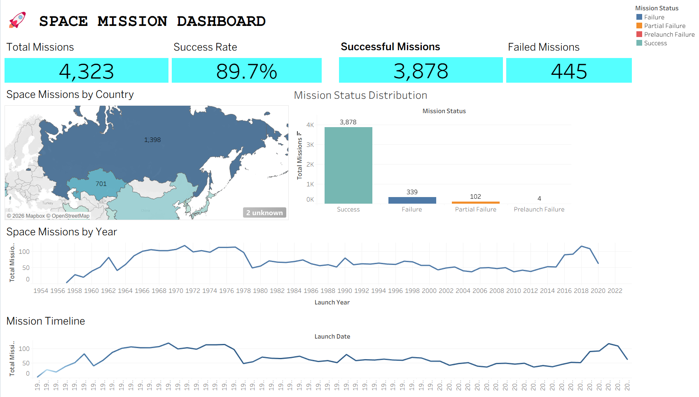

# 🚀 Interactive Space Mission Analytics Dashboard

## 📌 Project Overview

This project focuses on performing **Exploratory Data Analysis (EDA)** and developing an **interactive Tableau dashboard** using historical space mission data.

The dataset contains **4,323 space missions conducted between 1957 and 2022**, covering information related to launch dates, countries, companies, launch locations, mission status, and rocket costs.

The project transforms raw historical data into meaningful insights through **Python-based data analysis, data cleaning, feature engineering, and Tableau visualizations**.

---

## 🎯 Objectives

- Perform end-to-end **Exploratory Data Analysis (EDA)** on space mission data.
- Clean and preprocess the dataset for analysis.
- Analyze mission success rates and mission outcomes.
- Compare space missions across countries and companies.
- Explore rocket costs and their relationship with mission success.
- Identify important launch locations and geographical patterns.
- Analyze launch trends across years, decades, months, and quarters.
- Develop an interactive **Tableau Business Intelligence dashboard**.

---

## 📊 Dataset

**Dataset:** Space Missions (1957–2022)  
**Records:** 4,323 space missions  
**Time Period:** 1957–2022  
**Source:** Kaggle

The dataset contains information related to:

- Launch Date
- Launch Location
- Country
- Space Company
- Mission Status
- Rocket Status
- Rocket Cost (where available)
- Mission Outcomes

🔗 **Dataset Source:**  
https://www.kaggle.com/datasets/agirlcoding/all-space-missions-from-1957 

---

## 🛠️ Tech Stack

- **Python** – Data analysis and preprocessing
- **Pandas & NumPy** – Data manipulation and numerical analysis
- **Matplotlib & Seaborn** – Data visualization
- **Google Colab** – EDA and notebook development
- **Tableau** – Interactive dashboard development
- **GitHub** – Project hosting and documentation

---

## 🔎 Exploratory Data Analysis

The EDA workflow included:

- Dataset loading and understanding
- Missing value analysis and handling
- Duplicate detection and removal
- Data type correction
- Date processing and launch year extraction
- Country data cleaning and standardization
- Statistical analysis using mean, median, and mode
- Visual analysis using bar plots, histograms, box plots, and heatmaps
- Pattern and trend identification
- Feature engineering
- Preparation of cleaned and Tableau-ready datasets

---

## 📊 Interactive Tableau Dashboard

The project includes multiple interactive dashboard views covering:

### 🌍 Geographic & Mission Status Analysis
- Top countries by missions
- Average rocket cost by country
- Mission status distribution
- Mission success rate

### 🏢 Company & Cost Analysis
- Top space companies by missions
- Company success rate comparison
- Rocket cost vs success rate
- Companies operating by country

### 🚀 Launch Analysis
- Launches by month
- Quarterly mission trends
- Top launch locations
- Missions by decade

### 📈 Executive Overview
- Total missions
- Successful missions
- Failed missions
- Overall success rate
- Missions by country
- Missions by year
- Mission timeline

---

## 🖼️ Dashboard Preview



> The complete Tableau workbook and additional dashboard screenshots are available in the `Tableau_Dashboard` folder.

---

## 💡 Key Insights

- Russia and the USA are among the leading countries by total recorded missions.
- A relatively small number of major spacefaring nations account for a significant share of historical missions.
- Successful missions represent the dominant share of recorded mission outcomes.
- A small number of major space organizations account for a substantial portion of historical mission activity.
- Rocket costs vary significantly across countries and companies.
- Higher average rocket cost does not necessarily guarantee a higher mission success rate.
- Space mission activity has changed considerably across different decades.
- The 1970s represent one of the most active periods in the historical dataset.
- Launch activity varies across months, quarters, and geographical locations.

---

## 🔄 Project Workflow

```text
Raw Dataset
    ↓
Data Cleaning & Preprocessing
    ↓
Exploratory Data Analysis
    ↓
Statistical & Visual Analysis
    ↓
Pattern Identification
    ↓
Feature Engineering
    ↓
Cleaned & Tableau-Ready Data
    ↓
Interactive Tableau Dashboard
    ↓
Insights & Data Storytelling

---

## 🎯 Conclusion

The **Interactive Space Mission Analytics Dashboard** transforms historical space mission data into meaningful and interactive visual insights. By combining **Python-based EDA, data preprocessing, feature engineering, and Tableau visualization**, the project provides a comprehensive view of global space exploration, mission success, company performance, rocket costs, geographical distribution, and launch trends.

Overall, the project demonstrates how data analytics and visualization can turn complex historical data into clear insights that support better understanding of global space missions and their evolution over time.